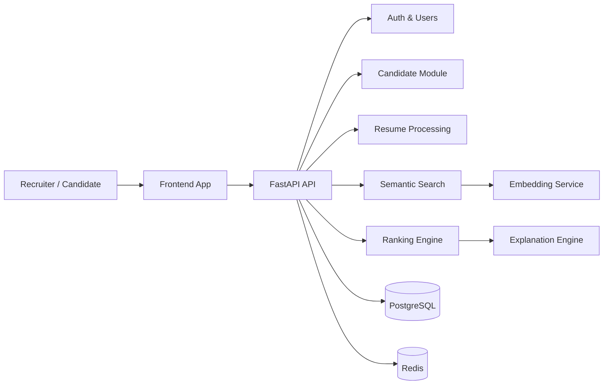

# TalentMind AI

TalentMind AI is a production-grade, AI-powered talent intelligence platform for recruiting, candidate discovery, resume intelligence, semantic search, and ranking workflows.

[](https://www.python.org/)
[](https://fastapi.tiangolo.com/)
[](https://www.sqlalchemy.org/)
[](https://opensource.org/licenses/MIT)
[](https://github.com/your-org/talentmind-ai/actions/workflows/backend-ci.yml)

## Overview

TalentMind AI combines modern backend engineering with AI-native recruiting workflows:

- semantic candidate search
- resume ingestion and parsing
- ranking and explanation services
- recruiter and candidate management
- production-ready API architecture

## Architecture



## Tech Stack

- Python 3.12+
- FastAPI
- SQLAlchemy 2.0 + Alembic
- PostgreSQL
- Redis
- Pydantic v2
- Docker / Docker Compose
- pytest

## Repository Structure

```text
backend/        # FastAPI application
frontend/       # Web frontend
infra/          # Infrastructure assets
docs/           # Documentation and diagrams
scripts/        # Automation scripts
datasets/       # Sample data
```

## Quick Start

### Prerequisites

- Docker Desktop or Docker Engine
- Python 3.12+
- Git

### Using Docker

```bash
docker compose up --build
```

### Local Backend

```bash
cd backend
python -m venv .venv
source .venv/bin/activate  # Windows: .venv\Scripts\activate
pip install -r requirements.txt
pytest
```

## API Documentation

When running locally:

- Swagger UI: http://localhost:8000/docs
- ReDoc: http://localhost:8000/redoc

## Roadmap

See [ROADMAP.md](ROADMAP.md) for planned milestones.

## Screenshots

Placeholder for future product screenshots and UI previews.

## Contributing

See [CONTRIBUTING.md](CONTRIBUTING.md).

## License

This project is licensed under the MIT License. See [LICENSE](LICENSE).
